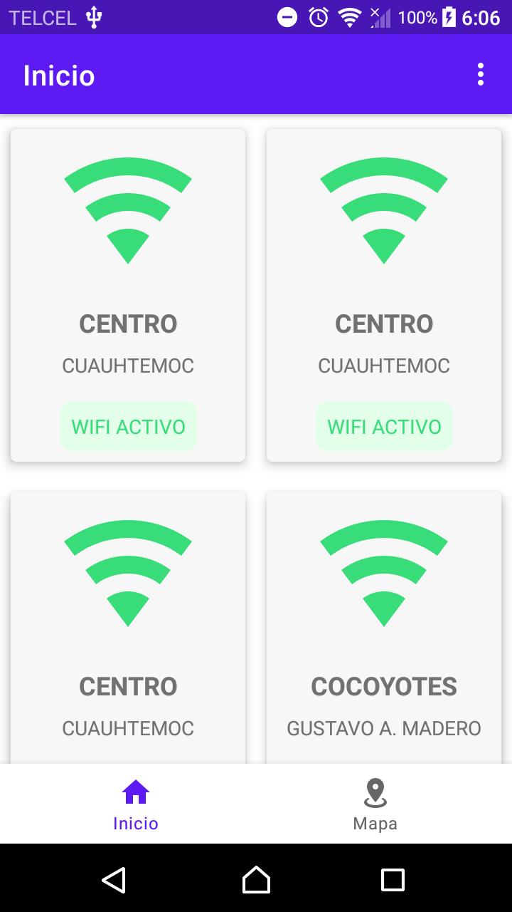
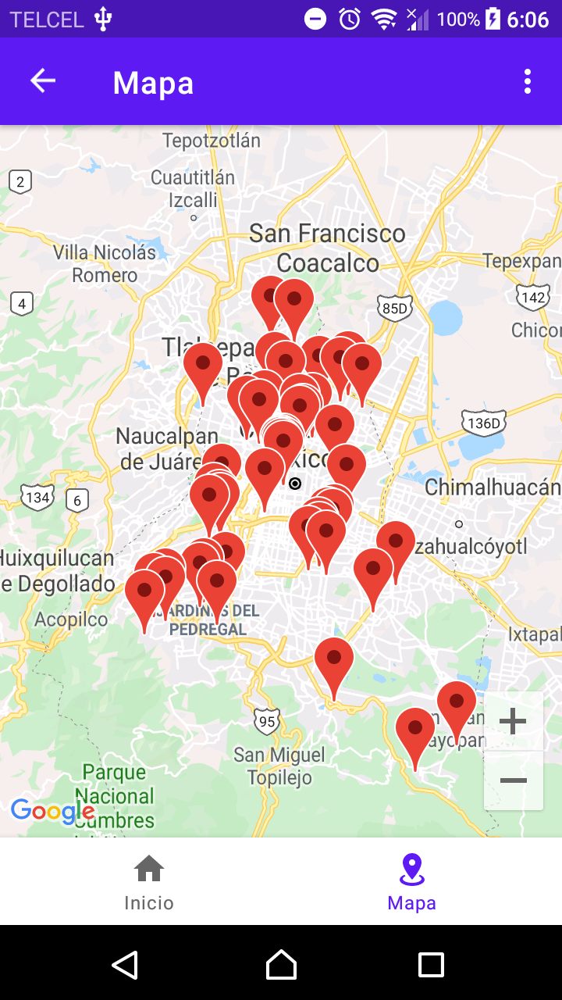
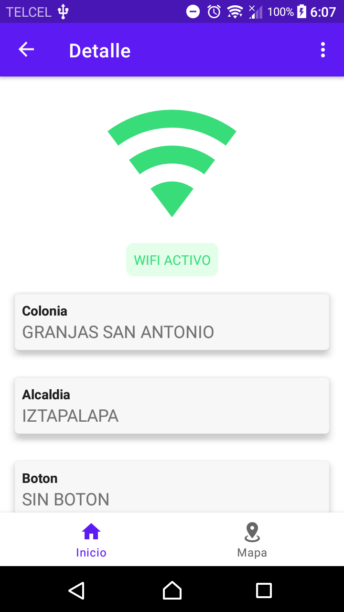

# Wifi CDMX

Información sobre los postes y pilares que cuentan con WiFi gratuito desde el Portal de datos de la Ciudad de México.

    <table>
      <tr>
        <td>
          
        </td>
        <td>
          
        </td>
        <td>
          
        </td>
      </tr>
    </table>

  <a href="https://datos.cdmx.gob.mx">Visita https://datos.cdmx.gob.mx para mas informaci�n</a>

